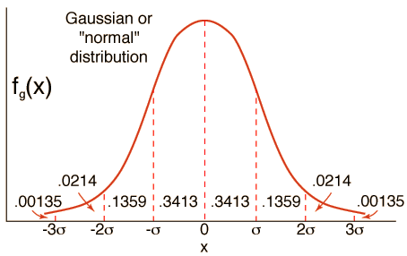
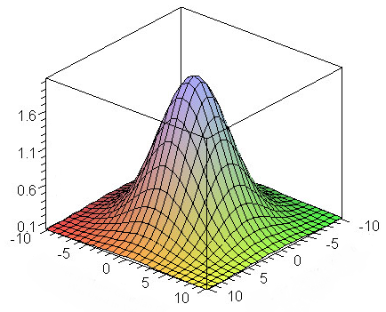

#CSC320 Lecture 2
Image Sampling, Interpolation, Antialiasing
2015-01-14

## Image Sampling, photos
- Digital photos are a created from light cast on a series of sensors
- it's pixels

## Example: Audio
(one dimensional)

- when your sample rate is high with relation to your frequency, you can interpolate by drawing a smooth curve to get a near-accurate reconstruction of the sample rate
- if your sample rate is too low, the reconstruction will lose information, can recreate an entirely different sound

## Aliasing
Aliasing is when data gathered with a low sample rates shows patterns other than the one the data was sampled from. Typically this happens when the frequency of the pattern is much higher than that of the sample rate (Undersampling).

- wheel going backwards / stationary
- low sample rate on high frequency sin wave -> low pitch on reconstruction
- disintegrating textures (checkerboard falling back into the distance)

## Solutions to Aliasing
- sample more often
	- physical limitations means this can't go on forever
- make the signal less "wiggly"
	- get rid of high frequencies
	- will lose information
	- better than aliasing

## Filters

### Moving Average
simple filter that removes higher frequencies
define a new function by averaging over a sliding window

### Weighted Moving Average
same as the moving average, but values closer to the value you are calculating are weighted more heavily than one farther away

This is essentially a cross correlation of the singal and a "moving weight vector"

**In 2d:** instead of a 1d matrix, a 2d matrix overlaid on the image.

## Cross-Correlation filtering
for some averaging window $(2k+1)x(2l+1)$
$$$
G[i,j] = \frac{1}{(2k +1)^2} \sum_{u=-k}^{k}(\sum_{v=-k}{k}( F[i+u, j+v]))
$$$
We can generalize this idea by allowing different weifhts for different neighboring pixels
$$$
G[i,j] = \sum_{u=-k}^{k}(\sum_{v=-k}{k}( H[u,v] F[i+u, j+v]))
$$$
This is the **cross-correlation** operation and is written $H \otimes F$
where $H$ is the mask/filter/kernel

### Mean(Box) versus Gaussian Filtering
different weighted filters have different results in the final product
The mean filter tends to produce square-edged artifacts around especially variant datapoints, where the gaussian filter tends to be smoother.
this is called **ringing**

|<td colspan="5">**mean filter**</td>|
|-|-|-|-|-|
|0|0|0|0|0|
|0|1|1|1|0|
|0|1|1|1|0|
|0|1|1|1|0|
|0|0|0|0|0|

|<td colspan="5">**gaussian filter**</td>
|-|-|-|-|-|
|0|0|0|0|0|
|0|1|1|1|0|
|0|1|1|1|0|
|0|1|1|1|0|
|0|0|0|0|0|

### Convolution
**IMPORTANT: REVISIT THIS**

A *convolution* operation is a cross-correlation where the filter is flipped both horizontally and vertically before being applied to the image.

$$$
G[i,j] = \sum_{u=-k}^{k}(\sum_{v=-k}{k}( H[u,v] F[i-u, j-v]))
$$$

It is wrtten $H \star F$

For symmetric filter matricies, this has no effect. It does become important in the context of imaginary numbers (but we don't tneed to worry about that for now).

**Colvolution is**

- commutative : $a \star b = b \star a$
- associative : $a \star (b \star c) = (a \star b) \star c$
- distributive over an additor : $a \star (b + c) = (a \star b) + (a \star c)$
- scalars factor out : $\alpha a \star b = a \star \alpha b$
- identity: unit impulse : $e = [... , 0 , 1 , 0, ...]$

## Other filters
### Gradient
looks for areas of immediate difference -> tends to pick up immediate differences, so it shows up when some object occludes another (partially obscuresit by being in front).

|<td colspan="2">**h grad**</td>
|-|-|-|-|-|
|1|0|-1|
|2|0|-2|
|1|0|-1|

|<td colspan="2">**v grad**</td>
|- |- |- |
|1 |2 |1 |
|2 |0 |0 |
|-1|-2|-1|

### Gaussian Filtering
Removes "high-frequency coponents from the image (low-pass filter)
images become more smooth

$$$ 
G(x) = \frac{1}{\sqrt{2 \pi \sigma ^2}} e^{-\frac{x^2}{\sigma ^2}}
$$$

note: $\sigma$ defines the width of the gaussian, almost all of the gaussian is contained within $3 \sigma$ of the center

### Gaussian in 2 dimensions

The 2d Gaussian is the product of 2 1 dimensional gaussian

(a hump that looks like a gaussian when viewed from any horizontal angle)
$$$
G_{2d}(x,y) = G(x) * G(y)
$$$

**Note**: the convolution of any 2 gaussians is a gaussian. The convolution of a gaussian with itself is the same gaussian.

### Median Filtering
selects the median value of the intensities in the neighborhood.
(because average is a nonresistive measure of centre)

resistive to outliers

Large loss of information, creates 'cel-shaded' images

## Filtering near the Edge
The filter falls of the edge of the image, you need to extrapolate

- clip filter (black, creates a noticable vignette effect)
- wraparound (works well for tiled images)
- copy edge (replicate the last line going outward)
- reflect across the edge (flip the image and place on the other side of the edge)

## Image Half-Sizing

- **sub-sampling**: take every other pixel (vulnerable to aliasing with high-frequency patterns)
- **Gaussian (lowpass) pre-filtering**: filter the image with a gaussian of the same width as your size reduction, and then subsample.
    - (a 1/4 size reduction requires a 4 pixel wide gaussian)
	- you can represent an NxN Image as a "pyramid" of $1x1, 2x2, 4x4, ... 2^n x 2^n$ size images. A nice metaphor because each layer corresponds to a 1/2 size gaussian on the previous level.
    - Often used in other image processing techniques, because it does not occupy a large amount of space, and its cool yo

## Misc
### Contrast Normalization
used for comparing images with different overall darkness/lightness

Contrast Normalization makes the lowest intensity 0 and the greatest intensity 1
$$$ I -> I-\frac{min(I)}{max(I)-min(I)} $$$

### Salt and Pepper Noise
Setting pixels at random to all-white or all-black.
Not fixed with Gaussian smoothing, but a median filter will work

In practice, it happens with dead sensors / pixels on a camera.

(check the website on friday for the associatd homework)

