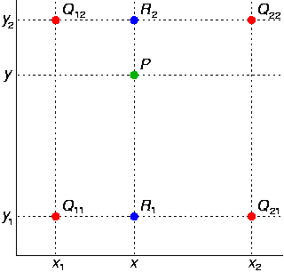

# CSC3420 Lecture 4
Interpolation and Upscaling
2015-01-28

###Problem:
when you try to upscale an image, how do you know what values the new pixels are supposed to have?

#### Nearest Neighbor Interpolaton
- The estimate for $f(x)$ is $f(X_n)$ where $X_n$ is the closest point to $x$ for which $f(X_n)$ is available (mapping proportionally)
    - (Exactly map the values of the low-scale image to the high scale image)
- leads to square blocks of pixels corresponding to sections of the smaller image in the upscaled one

#### Linear Interpolation
- the value of a $f(x)$ is the weighted average of the closest neighbors of $x$
    - In one dimension, if $f(x_0)$ and $f(x_1)$ are the closest points to $x$, then
        $$
      	f(x) = f(x_0) \frac{x_0 - x}{x_1 - x_0} + f(x_1) 
     	\frac{x_0 - x}{x_1 - x_0}
        $$
- The graph of $f(x)$ in one dimension is a series of straight line segements drawn between the known points

#### Bilinear Interpolation
- Select four points (presumably in a grid/square)
- perform a linear interpolation between two sets of points
- Perform a linear interpolation of point $p$ between $r_1$ and $r_2$

#### Gaussian Reconstruction
- under each known point, add a gaussian distribution of height equal to the known value, an take the sum of all those gaussian distributions to form the output.

###Upsampling in Practice

- expand the image (mapping by spaces)
- leave empty pixels at zero
- -convolve with a filter
- if the filter sums to 1, multiply the result by the upscaling factor
- 3/4 of thhe new image was initially 0

